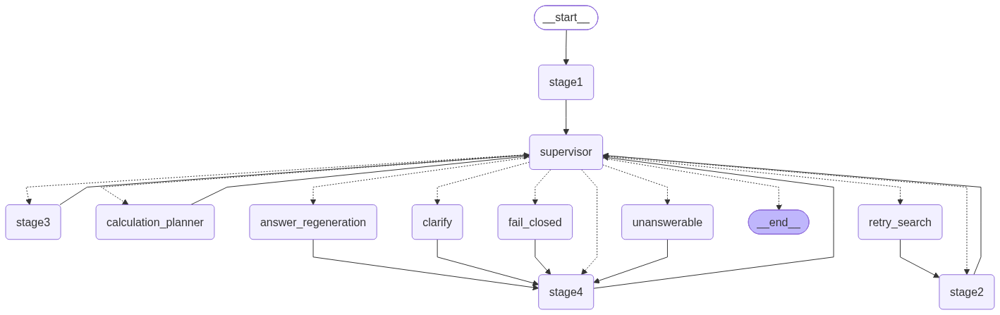
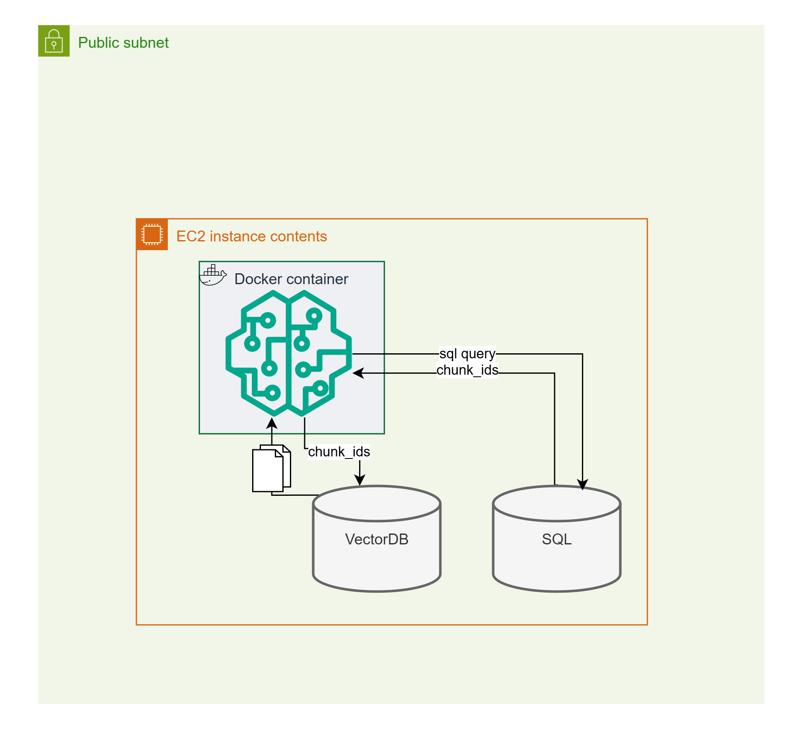

# dis-164

AI Festival 2026 공시 질의 응답 Agent 실행 엔진.

## 현재 canonical 구조

```text
app.py                  # FastAPI 진입점
config.py               # 프로젝트 루트 기준 경로·Stage2 모드 단일 설정 지점
integration/            # LangGraph 조립, Supervisor, API adapter
shared_state.py         # 공용 AgentState와 Stage write contract
stage1/                 # 질의 정규화·Intent·manifest filter
stage2/                 # local SQLite / Chroma hybrid retrieval·embedding·rerank
stage3/                 # Fact·event·계산·답변 초안
stage4/                 # 수치·출처·의미 검증
legacy/                 # 현재 실행 경로가 아닌 과거 구현 보관
tests/                  # 현재 통합 계약 테스트
```

실행 흐름은 `Stage1 → Supervisor → Stage2 → Supervisor → Stage3 → Supervisor → Stage4 → Supervisor`다. Supervisor는 허용된 action만 선택하고, 실제 Stage 작업과 반복 제한은 코드가 담당한다.

## 그래프 구조

`integration/graph.py`가 조립하는 실제 LangGraph 상태머신이다. Stage별 phase 갱신과 소유권 검증은
각 Stage 노드를 감싸는 훅으로 처리되어 별도 노드로 나타나지 않고, 4단계 Supervisor는 하나의
`supervisor` 노드로 합쳐져 있다.



그래프 구조(노드·엣지)가 바뀌면 다음 명령으로 다시 뽑는다. 저장된 이미지가 실제 코드와 항상
일치하도록, 손으로 그리지 않고 이 스크립트로만 갱신한다.

```powershell
python scripts/render_graph.py --png integration/graph.png
```

## NCP & instance level architecture



단일 ec2인스턴스 내 
- 단일 agent app
- vector DB, RDB 가 포함되어 있다.

## 설치 및 실행

```powershell
python -m pip install -r requirements.txt
python -m pip install -r requirements-langgraph.txt
python -m pip install -r requirements-dev.txt
uvicorn app:app --reload
```

기본 factory는 `integration/composition.py`에서 Stage1~Stage4를 조립한다. 경로와 Stage2 모드
선택은 모두 프로젝트 루트의 **`config.py`** 한 곳에서 관리한다. 환경변수의 상대경로는
실행 CWD가 아니라 프로젝트 루트를 기준으로 해석된다.

Stage2는 제공된 인덱스를 사용하는 `local` 모드만 지원한다.

- `local`: 제공된 로컬 SQLite(`STAGE2_INDEX_PATH`)의 `chunk_index`로
  `manifest_filter`를 SQL `WHERE`절로 필터링하고, 기존 Chroma persistent HNSW 파일을
  query-only로 읽는다. 현재 제공 인덱스는 최신 Chroma writer와 호환되지 않는 legacy
  HNSW pickle 형식이므로 애플리케이션은 Chroma migration/client를 열지 않고
  `chroma.sqlite3`를 SQLite `mode=ro`로 읽으며 HNSW 파일을 직접 검색한다. 질의 임베딩은
  `STAGE2_EMBEDDING=e5`, 즉 `intfloat/multilingual-e5-large` 하나로 고정한다.
  문서와 질의는 저장 인덱스와 같은 1024차원 E5 공간을 사용하며, `e5-instruct`는
  active 경로에서 허용하지 않는다.
`STAGE2_CHROMA_COLLECTION`(기본 `chunk_vectors`)은 제공 인덱스를 만든 시점의 컬렉션
이름과 일치해야 한다. `STAGE2_MODE=container`를 포함해 `local` 외의 값은 readiness에서
허용되지 않으며, 자동으로 local 모드로 전환하지 않는다.

제공된 local 인덱스는 SQLite `chunk_index` 약 1,155,170행과 Chroma `chunk_vectors`
약 800,460개 벡터로 구성되어 있다. 벡터 커버리지와 Stage1 manifest 문서 집합이 완전히
일치하지 않을 수 있으므로, 해당 인덱스를 테스트할 때만
`STAGE2_ALLOW_PARTIAL_INDEX=true`를 명시한다. 스키마·빈 테이블·차원 오류는 계속 실패한다.
`chunk_index`와 Chroma collection의 ID 관계는 readiness에서 확인하며, HNSW에 실제로
검색 가능한 벡터가 없는 후보는 결과에서 제외된다.

Stage1 corpus 자동 탐색이 실패하는 실행 환경에서는 `CORPUS_DIR`에 `universe.csv`와
`manifest.jsonl`이 있는 corpus 디렉터리를 명시한다(상대경로는 루트 기준).

E5 모델 cache가 없으면 Stage2 초기화가 명확히 실패한다. CLOVA API key는 답변 생성,
Stage1 슬롯 보완 또는 Reranker 중 하나를 활성화할 때만 필요하다. 의미 검증 provider가
없거나 실패하면 숫자·출처·Fact grounding local gate만 통과한 답변을 제한적으로 허용한다.

제공된 local 인덱스를 테스트하려면 다음처럼 설정한다. 압축본을 다시 풀거나 인덱스를
재생성하지 않으며, 실행 중 SQLite·Chroma에 쓰지 않는다.

```powershell
$env:STAGE2_MODE = "local"
$env:STAGE2_INDEX_PATH = "data/team-feature2-local-db/local_db/chunk_index.db"
$env:STAGE2_CHROMA_PATH = "data/team-feature2-local-db/local_db/chunk_index_chroma"
$env:STAGE2_CHROMA_COLLECTION = "chunk_vectors"
$env:STAGE2_SQL_TABLE = "chunk_index"
$env:STAGE2_EMBEDDING = "e5"
$env:STAGE2_ALLOW_PARTIAL_INDEX = "true"
$env:CLOVA_LLM_ENABLED = "true"       # 답변 생성·semantic validation
$env:STAGE1_USE_LLM = "0"              # unresolved 슬롯 보완
$env:QUERY_PLANNER_LLM_ENABLED = "false" # unresolved 복합 계산 plan 보완
$env:CLOVA_RERANKER_ENABLED = "false" # production Reranker 기본 OFF
$env:CLOVA_RERANKER_CANDIDATE_LIMIT = "100"
python scripts/check_deployment.py
uvicorn app:app --reload
```

제공 인덱스의 구조·대표 질의·read-only 파일 불변성·mock 전체 pipeline 검증은 다음 명령으로
실행한다. 이 검증은 네트워크 다운로드나 인덱스 변경을 수행하지 않는다.

```powershell
python scripts/check_real_index.py --allow-partial-index
pytest -m real_index
```

일반 `pytest`는 대용량 인덱스에 의존하지 않으며 `real_index` marker를 자동 제외한다.
검색 백엔드 실험은 `docs/retrieval-experiments.md`의 별도 sidecar에서 실행하고,
production Reranker 외부 변동은 섞지 않는다.

`CORPUS_DIR`는 Stage1의 `universe.csv`·`manifest.jsonl` 경로로 유지한다. E5 모델은
서버의 Hugging Face 캐시에 미리 준비되어 있어야 하며, 기동 시 외부 다운로드는 하지 않는다.
이후 `/answer`는 기존 API의 5개 문자열 필드를 반환한다.

## API

```text
GET /health
GET /ready
GET /answer?question_id=Q-001&question=질문내용
```

응답은 `question_id`, `question`, `retrieved_context`, `think_trace`, `answer`의 다섯 문자열 필드를 유지한다. `think_trace`에는 Supervisor action과 주요 시도 횟수가 포함된다. Stage1이 생성한 `intent.think_trace`도 `stage1_think_trace`로 함께 기록된다. 답변 불가·근거 부족 시 `answer`는 기존 결론 문장 뒤에 결정론적인 이유와 필요한 경우 재질문 안내를 덧붙이며, 내부 `failure_reason_code`는 trace에만 기록한다. 공개 문장은 약 300자로 제한하고 API key·원시 provider 오류·검색 점수는 포함하지 않는다.

`/health`는 FastAPI 프로세스의 liveness만 확인하므로 corpus나 DB가 아직 마운트되지 않아도 응답한다. `/ready`는 pipeline을 지연 초기화하여 Stage1 corpus, Stage2 저장소, provider 설정을 포함한 실행 준비 상태를 확인한다. `/answer`도 pipeline이 준비되지 않은 경우 안전하게 503을 반환한다.

## 검색과 안전 제어

## Stage2·Stage3 process-local cache

canonical `integration.composition.build_pipeline()`은 pipeline마다 독립적인
`CacheRegistry`를 만들고 Stage2·Stage3에 주입한다. 캐시는 원본 인덱스를 대체하지
않는 bounded TTL/LRU 메모리 최적화 계층이다.

- E5 질의 임베딩은 `build_search_query()` 이후 최종 검색 질의를 key로 재사용한다.
- 동일 `manifest_filter`의 SQL 후보 문서는 본문을 포함해 재사용하지만, keyword/vector/hybrid
  정렬과 최종 Reranker 결과는 매 실행 계산한다.
- 구조화 본문 parsing은 chunk ID·본문 SHA-256·parser version으로, Fact는 문서·metric·계산·basis
  등 추출 profile로 구분해 재사용한다.
- 기본 TTL은 600초이며 `DIS164_CACHE_*` 환경변수로 전체·개별 cache를 조정할 수 있다.
- cache hit/miss는 사용자 답변·`think_trace`에 노출하지 않는다. cache 오류는 원래 계산으로
  우회하며, CLOVA Chat/Reranker 응답은 cache하지 않는다.
- worker 간 cache 공유나 Redis는 추가하지 않으며, SQLite·Chroma 인덱스는 계속 read-only다.

```text
Stage1 manifest_filter
→ query embedding
→ keyword search + vector search
→ ID 기준 merge
→ deterministic hybrid rank
→ (선택) CLOVA Reranker
→ cited_documents
```

- `question_id`, `question`, `original_question`은 실행 중 불변이다.
- Stage별 partial update는 `STAGE_WRITE_FIELDS`로 검증한다.
- Supervisor 전체 단계는 기본 12회, 검색·planner 재시도는 기본 1회다.
- 답변 재생성은 최대 1회다.
- `CLOVA_RERANKER_ENABLED=true`일 때만 상위 100개 후보를 CLOVA Reranker에 보내며,
  실패하면 전체 merged 후보의 deterministic 순위로 fallback한다. `suggestedQueries`는
  trace에만 기록한다.
- `STAGE1_USE_LLM=1`일 때만 규칙으로 unresolved 상태인 Stage1 슬롯에 CLOVA Chat을 호출한다.
- 잘못된 action, provider 오류, 근거 부족은 fail-closed 처리한다.

## 검증

```powershell
python -m unittest discover -s tests -p "test_*.py"
python -m stage1.tests.run_checks
pytest stage1/tests
python -m compileall -q integration shared_state.py stage1 stage2 stage3 stage4
pytest
```

`legacy/` 문서는 과거 backend의 설계·검증 기록이며, 현재 실행 경로의 기준은 `integration/composition.py`와 `integration/graph.py`다.

## 로컬 무비용 E2E

외부 CLOVA·대용량 DB·임베딩 서버 없이 일반 회귀를 검증하려면
`integration.testing.build_deterministic_pipeline()`에 deterministic Intent와 InMemory 문서를
주입한다. 이 factory와 InMemoryRetriever는 테스트 전용이며 production fallback으로 사용하지
않는다. local store 계약 테스트는 임시 SQLite/Chroma를 사용한다.

```powershell
pytest tests/test_local_e2e.py
```

실제 CLOVA 호출은 provider 환경변수가 설정된 NCP smoke에서만 수행한다. CI와 `check_real_index.py`
pipeline 검증은 deterministic Stage3·Stage4 provider를 사용한다.
배포 전 오프라인 구성 검사는 `python scripts/check_deployment.py`로 실행한다. 이 검사는 CLOVA endpoint를 호출하지 않고 corpus, SQLite·Chroma index의 일관성까지 검사한다.
답변·semantic timeout은 `CLOVA_CHAT_TIMEOUT`, 429 재시도 대기 상한은
`CLOVA_RATE_LIMIT_MAX_WAIT`로 조정한다.
실행 중 adapter의 `last_rate_limit`에서 API가 반환한 `x-ratelimit-*` 헤더를 확인할 수
있으며, API key와 요청 본문은 기록하지 않는다.
호출 전에는 Chat·Reranker·Stage1 슬롯 호출이 하나의 process-local QPM·TPM limiter를
공유해 예상 입력·출력 토큰 예산과 provider 잔여량을 확인한다.
`CLOVA_RATE_LIMIT_QPM`, `CLOVA_RATE_LIMIT_TPM`, `CLOVA_CHAT_MIN_INTERVAL`로
보수적인 로컬 한도를 조정할 수 있다. provider가 보낸 rate-limit header와 로컬 차단
상태는 Stage trace의 `provider_status`에 구조화해 남긴다.
`DIS164_STRICT_GROUNDING_V2`는 요청 조건과 정확히 일치하는 Fact만 답변·검증에
사용하는 grounding gate이며 기본값은 `true`다. 문제 발생 시 일시적으로 `false`로
되돌릴 수 있지만, 대회 평가 전에는 기본값을 유지하고 회귀 테스트를 통과해야 한다.
답변·semantic 출력 토큰 기본값은 각각 256·128이며 `CLOVA_ANSWER_MAX_TOKENS`와
`CLOVA_SEMANTIC_MAX_TOKENS`로 조정할 수 있다. 답변 prompt는 기본적으로 Fact 8개,
출처 4개·출처별 근거 500자까지, semantic prompt는 Fact 10개·출처 4개·출처별
근거 500자까지 전달한다. 이 범위는 `CLOVA_PROMPT_*`와 `CLOVA_SEMANTIC_*`
prompt 환경변수로 조정할 수 있다.

기본 factory는 metadata-filtered 후보 최대 1,000개에서 keyword·vector branch를 각각
최대 100개까지 합치고, hybrid 결과 최대 200개를 Stage3에 전달한다. Reranker를 켜면
상위 100개를 전송하고 최종 후보도 최대 100개로 제한한다. 제공 인덱스에서
집계표가 자회사·부문 chunk보다 낮게 검색되더라도 Stage3가 현재기 표를 회수할 수 있게
하기 위한 설정이며, 외부 LLM prompt는 별도로 축약된다.

Stage3 답변 생성은 질문과 관련된 Fact를 우선 전달한다. strict grounding client가 핵심
수치 또는 citation ID를 포함하지 않은 답변을 반환하면 deterministic grounding fallback으로
교체하여, lookup 답변에 기업·기간·기준·지표·값·출처 문서ID가 남도록 한다.
