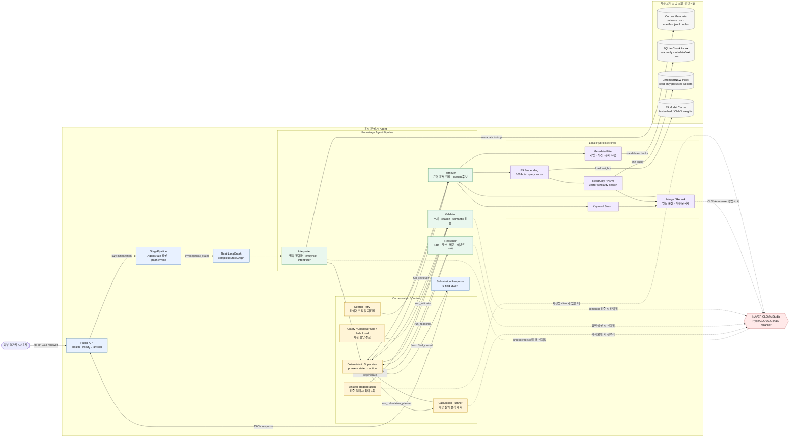
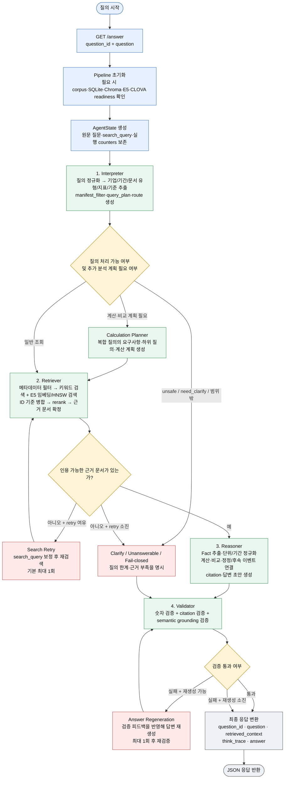

# 기술제안서 반영용 시스템 구성도 및 주요 기능 흐름도

## 작성 기준

이 문서는 현재 `C:\projects\dis-164`의 canonical 실행 경로를 기준으로 작성했다. 설계 문서에만 존재하거나 현재 `/answer` 경로에 연결되지 않은 기능은 구성도에 포함하지 않았다.

- 서비스 형태: Python FastAPI 기반 단일 프로세스 modular monolith
- 외부 진입점: `GET /answer?question_id=...&question=...`
- 실행 조정: `StagePipeline`이 `AgentState`를 생성하고 compiled LangGraph를 실행
- 기본 Supervisor: LLM이 아닌 `DeterministicSupervisor`
- 검색: 제공 공시 코퍼스의 메타데이터 필터 + 키워드 검색 + E5/HNSW 벡터 검색
- 분석: Fact 추출, 정규화, 계산·비교·이벤트 연결, citation 생성
- 검증: 숫자·근거·의미 검증 및 필요 시 1회 답변 재생성
- 외부 AI: CLOVA Studio 연동은 환경 설정에 따라 선택적으로 수행
- 데이터 경계: 평가 중 외부 DART·뉴스·리포트 API를 호출하지 않고 제공 코퍼스와 로컬 인덱스를 사용

---

## 1. 시스템 구성도

### 기술제안서용 설명문

본 시스템은 외부 평가자의 공시 질의를 FastAPI 공개 API로 수신하고, 단일 Python 프로세스 내부의 LangGraph 기반 4단계 Agent 파이프라인에서 처리한다. Interpreter가 질문의 기업·기간·공시 유형·지표·비교 조건을 구조화한 뒤, Retriever가 제공 공시 코퍼스의 메타데이터 필터와 키워드·벡터 검색을 결합해 근거 문서를 찾는다. Reasoner는 검색 결과에서 Fact를 추출하고 필요한 계산·비교·정정·후속 공시 연결을 수행하며, Validator는 답변의 수치와 citation, 의미적 근거성을 검증한다. 검색 인덱스와 E5 임베딩 모델은 읽기 전용 로컬 자원으로 사용하고, CLOVA Studio는 답변 생성·의미 검증·선택적 reranking이 필요한 경우에만 연동한다.

### 시스템 구성도



### 구성 요소 설명

| 구성 요소 | 역할 | 기술·구현 기준 |
|---|---|---|
| Public API | 평가자의 질의를 수신하고 최종 JSON을 반환 | FastAPI, `/health`, `/ready`, `/answer` |
| StagePipeline | 요청별 초기 상태를 만들고 그래프 실행을 시작 | `integration.service:StagePipeline` |
| Root LangGraph | 단계 실행 순서와 조건부 분기를 관리 | `integration.graph:build_graph` |
| Interpreter | 질문을 정규화하고 기업·기간·문서 유형·지표·계산 조건을 추출 | `interpreter` 모듈, corpus metadata 사용 |
| Deterministic Supervisor | 현재 phase와 결과를 바탕으로 다음 실행 노드를 선택 | 기본 동작은 규칙 기반 정책 |
| Retriever | 후보 필터링, 키워드·벡터 검색, 병합·reranking 수행 | SQLite + E5/HNSW + 선택적 CLOVA reranker |
| Reasoner | 원문·표·XML/HTML에서 Fact를 추출하고 계산·비교·이벤트를 수행 | 결정론적 분석 + 선택적 CLOVA 답변 생성 |
| Validator | 답변의 수치, citation, semantic grounding을 검증 | 실패 시 제한 응답 또는 1회 재생성 |
| 제공 코퍼스 | 기업·문서·기간·공시 유형의 기준 메타데이터 제공 | `universe.csv`, `manifest.jsonl`, 규칙 JSON |
| SQLite Chunk Index | 메타데이터 조건에 맞는 문서 후보와 텍스트 chunk 조회 | serving 시 read-only |
| Chroma/HNSW Index | E5 임베딩 기반 의미 검색 수행 | serving 시 persisted index read-only |
| E5 Model Cache | 검색 질의를 1024차원 벡터로 변환 | `intfloat/multilingual-e5-large`, fastembed/ONNX |
| CLOVA Studio | 답변 생성, semantic 검증, 선택적 reranking | 환경 플래그로 기능별 활성화 |

### 구성도에서 강조할 설계 포인트

1. **단일 배포 프로세스와 논리적 단계의 분리**: Interpreter·Retriever·Reasoner·Validator는 독립 서버가 아니라 하나의 FastAPI 프로세스 안에서 실행되는 논리적 구성 요소다.
2. **검색 근거의 이중화**: SQLite 메타데이터 필터로 검색 범위를 먼저 제한한 뒤 키워드 검색과 E5/HNSW 벡터 검색을 결합한다.
3. **읽기 전용 인덱스 운영**: 평가 요청 중에는 공시 원문과 SQLite·Chroma/HNSW 산출물을 수정하거나 재색인하지 않는다.
4. **선택적 외부 모델 연동**: CLOVA Studio는 모든 제어를 담당하는 Supervisor가 아니라 답변 생성·semantic 검증·reranking 등 지정된 지점에서 선택적으로 사용된다.
5. **근거 기반 안전성**: 검색 문서와 Fact가 부족하면 추측으로 답변하지 않고 clarification, unanswerable 또는 fail-closed 경로로 전환한다.

---

## 2. 주요 기능 흐름도

### 기술제안서용 설명문

사용자 질의는 API 수신 후 `AgentState`로 관리되며, 모든 주요 단계는 Supervisor를 거쳐 다음 단계로 이동한다. Interpreter는 질의의 의미와 검색 조건을 구조화하고, Retriever는 조건에 맞는 후보를 좁힌 후 키워드·벡터 검색 결과를 결합한다. 근거 문서가 확보되면 Reasoner가 수치와 사실을 추출해 계산·비교·이벤트 연결을 수행하고, Validator가 최종 답변의 수치와 인용 근거를 검증한다. 검색 결과가 부족하거나 답변 검증이 실패하는 경우에는 제한된 횟수의 재검색·재생성을 수행하며, 끝까지 근거가 확보되지 않으면 안전한 실패 응답으로 종료한다.

### 주요 기능 흐름도



### 단계별 기능 설명

#### 1) 요청 수신 및 실행 상태 초기화

`/answer`는 `question_id`와 `question`을 받고, 최초 요청 시 pipeline을 지연 초기화한다. `StagePipeline`은 질문 원문을 `original_question`에 보존하고, 각 단계의 결과·경고·검색 이력·재시도 횟수를 `AgentState`에 누적한다. 최종 응답은 평가 API 규격에 맞춰 5개 문자열 필드로 변환한다.

#### 2) Interpreter의 질의 구조화

질의를 정규화한 뒤 기업명·종목코드·섹터·기간·분기·공시 유형·지표·연결/별도 기준·정정 여부·비교 및 계산 조건을 추출한다. 이 정보는 `manifest_filter`, `search_query`, `query_plan`으로 변환되어 Retriever의 검색 범위를 제한한다. 위험 질의, 범위 밖 질의, 필수 정보가 부족한 질의는 검색 전에 각각 fail-closed, unanswerable 또는 clarification 경로로 보낸다.

#### 3) 복합 질의 분석 계획

여러 기업·연도·문서·계산 조건이 포함된 질문은 Calculation Planner가 필요한 하위 요구사항과 계산 순서를 만든다. 각 요구사항은 별도의 검색·분석 단위로 처리한 뒤 Reasoner 단계에서 결과를 합친다. deterministic planner를 우선 사용하고, 설정된 경우에만 CLOVA JSON 호출로 계획 보완을 수행한다.

#### 4) Hybrid Retrieval

Retriever는 먼저 SQLite Chunk Index에서 기업·기간·공시 유형 등 메타데이터 조건에 맞는 후보를 좁힌다. 이후 키워드 검색과 E5 임베딩 기반 HNSW 벡터 검색을 병렬적으로 수행하고, 문서 ID 기준으로 결과를 병합한다. 선택적 reranker를 적용한 뒤 연도·문서 다양성 및 relevance를 반영해 최종 근거 문서를 확정한다. HNSW는 요청 시 재생성하지 않고 사전에 준비된 persisted index를 읽기 전용으로 조회한다.

#### 5) Reasoner의 근거 기반 분석

검색 문서의 본문·표·XML/HTML에서 Fact를 추출하고, 수치·단위·기간·통화·연결/별도 기준을 정규화한다. 질문 유형에 따라 증감률·비중·합계·평균·순위 등을 결정론적으로 계산하고, 비교 대상이나 계약 체결·해지, 원공시·정정공시·후속공시의 관계를 연결한다. 이후 답변에 사용할 citation과 context를 구성한다.

#### 6) Validator의 품질·안전성 검증

Validator는 답변의 숫자가 Fact 또는 계산 결과와 일치하는지, citation이 실제 검색 문서에 존재하는지, 설명이 근거 범위를 벗어나지 않는지를 검사한다. 검증 실패 시 답변 재생성 기능이 활성화되어 있으면 최대 1회 재생성한 뒤 다시 검증한다. 재생성 후에도 검증에 실패하면 근거 없는 답변을 반환하지 않고 제한된 실패 응답으로 종료한다.

### Supervisor 분기 요약

| 발생 시점 | 조건 | 다음 흐름 |
|---|---|---|
| Interpreter 이후 | 일반 질의 | Retriever 실행 |
| Interpreter 이후 | 계산·비교·다중 조회 필요 | Calculation Planner → Retriever |
| Interpreter 이후 | unsafe, 범위 밖, 필수 정보 부족 | Fail-closed / Clarify / Unanswerable → Validator |
| Retriever 이후 | 인용 문서 존재 | Reasoner 실행 |
| Retriever 이후 | 문서 없음, 재시도 가능 | Search Retry → Retriever |
| Retriever 이후 | 문서 없음, 재시도 소진 | Unanswerable → Validator |
| Reasoner 이후 | 분석 결과 생성 | Validator 실행 |
| Validator 이후 | 검증 통과 | 최종 응답 |
| Validator 이후 | 검증 실패, 재생성 가능 | Answer Regeneration → Validator |
| Validator 이후 | 검증 실패, 재생성 소진 | Fail-closed 최종 응답 |

### 최종 API 응답

```json
{
  "question_id": "질의 ID",
  "question": "질의 원문",
  "retrieved_context": "실제 답변에 사용한 공시 근거",
  "think_trace": "검색·계산·검증 과정의 요약",
  "answer": "최종 답변 또는 제한된 실패 안내"
}
```

---

## 3. 제안서 작성 시 표현상 주의사항

- `Interpreter`, `Retriever`, `Reasoner`, `Validator`를 각각 독립 마이크로서비스라고 표현하지 않는다. 현재는 하나의 FastAPI 프로세스 내부 모듈이다.
- Supervisor는 현재 기본 실행 경로에서 LLM 기반 Agent가 아니라 `DeterministicSupervisor`다. LLM이 모든 단계를 ToolNode로 직접 제어한다고 쓰지 않는다.
- HNSW는 serving 요청 중 생성·재색인하는 저장소가 아니라 사전에 준비된 read-only 인덱스다.
- `retriever/ingestion/dart/`는 오프라인 데이터·인덱스 준비 코드이며, 평가 질의마다 OpenDART나 외부 금융 API를 호출하는 구조로 설명하지 않는다.
- CLOVA Studio는 기능별 환경 설정에 따라 답변 생성·semantic 검증·reranking 등에 선택적으로 사용된다. 검색 결과와 결정론적 계산·검증 경로를 CLOVA 호출 하나로 뭉뚱그리지 않는다.
- `reasoner/orchestration/langgraph_graph.py`의 one-node compatibility graph는 canonical root graph의 하위 그래프가 아니다. 시스템 구성도에는 별도 구성요소로 넣지 않는다.

---

## 4. 사용자 시나리오

### 4.1 시나리오 구성 기준

대회 자료는 평가 질의가 난이도 상·중·하와 Closed/Open-ended 유형을 혼합한다고 안내한다. 따라서 사용자 시나리오도 네 가지 유형을 대표하도록 구성한다. 각 시나리오는 서로 다른 핵심 기능을 보여주며, 실제 평가문제를 재현하는 것이 아니라 시스템 처리 범위를 설명하기 위한 예시다.

| 유형 | 대표 질의 | 핵심적으로 보여주는 기능 |
|---|---|---|
| 쉽고 명확한 Closed | 특정 기업의 2025년 연결기준 매출액은 얼마인가? | 단일 수치 검색·Fact 추출·숫자 검증 |
| 쉽고 명확한 Open | 특정 기업의 2026년 1분기 주요 투자 계획을 정리해줘. | 문서 내용 요약·항목별 citation·semantic 검증 |
| 어렵고 복합적인 Closed | 특정 기업이 2025년에 체결한 주요 계약 중 이후 해지된 계약이 있는가? | 체결·해지 공시 연결·존재 여부 판단·이력 citation |
| 어렵고 복합적인 Open | 특정 기업의 2023년과 2025년 사업보고서를 비교해 핵심 사업 변화를 설명해줘. | 다년 문서 비교·Fact 정렬·변화 설명·근거 완결성 |

### 4.2 쉽고 명확한 Closed 시나리오 — 단일 수치 조회

#### 사용자 질문

> “현대자동차의 2025년 연결 기준 매출액은 얼마인가?”

#### 사용자 목적

특정 기업·연도·연결 기준·단일 지표를 빠르게 확인하고, 해당 수치가 어느 공시에서 추출되었는지 확인한다.

#### 시스템 처리

1. 사용자가 `GET /answer`로 `question_id`와 질문을 전송한다.
2. Interpreter가 기업, 2025년, 매출액, 연결 기준을 추출하고 `manifest_filter`를 만든다.
3. Deterministic Supervisor가 일반 검색 경로를 선택한다.
4. Retriever가 정기공시 후보를 메타데이터로 제한한 뒤 키워드·E5/HNSW 검색으로 관련 Fact를 찾는다.
5. Reasoner가 매출액, 단위, 기준 기간, 연결 여부를 정규화하고 citation을 만든다.
6. Validator가 답변의 숫자와 근거 문서가 일치하는지 검증한다.

#### 사용자가 받는 결과

매출액, 기준 기간, 단위, 연결 기준, 근거 공시가 포함된 짧고 명확한 답변을 받는다. 이 시나리오는 `Interpreter → 단일 Retriever → Fact 추출 → numeric/citation validation` 능력을 보여준다.

### 4.3 쉽고 명확한 Open 시나리오 — 공시 내용 요약

#### 사용자 질문

> “현대자동차의 2026년 1분기 주요 투자 계획을 공시 기준으로 정리해줘.”

#### 사용자 목적

하나의 수치가 아니라 분기보고서 또는 관련 공시에서 여러 투자 계획과 세부 내용을 추출해 이해하기 쉬운 항목으로 정리한다.

#### 시스템 처리

1. Interpreter가 기업, 2026년 1분기, 투자 계획, 요약·설명 요청을 추출한다.
2. Retriever가 분기보고서와 관련 공시를 기간·기업·공시 유형으로 필터링하고, 키워드·벡터 검색으로 관련 문서를 수집한다.
3. Reasoner가 본문·표·구조화 데이터에서 투자 대상, 목적, 금액·기간 등 확인 가능한 Fact를 추출한다.
4. 질문이 요구한 항목별로 Fact를 묶고, 각 항목에 근거 citation을 연결해 답변 초안을 만든다.
5. CLOVA 답변 생성이 활성화된 경우 근거 기반 자연어 요약을 생성하며, 그렇지 않거나 호출에 실패하면 결정론적 grounded 답변으로 fallback한다.
6. Validator가 요약에 포함된 수치·사실과 citation, 근거 범위 밖의 표현을 검증한다.

#### 사용자가 받는 결과

투자 대상·목적·금액·기간 등 공시에서 확인되는 항목을 구조화한 요약과 각 항목의 근거 공시를 받는다. 이 시나리오는 `text/fact extraction → 항목별 답변 구성 → semantic/citation validation` 능력을 보여준다.

### 4.4 어렵고 복합적인 Closed 시나리오 — 계약 체결·해지 이력 연결

#### 사용자 질문

> “특정 기업이 2025년에 체결한 주요 계약 중 이후 해지된 계약이 있는가? 있다면 계약명과 해지일을 알려줘.”

#### 사용자 목적

체결 공시와 이후 해지 공시가 같은 계약을 가리키는지 확인하고, 최종적으로 해지 계약의 존재 여부와 목록을 정확하게 확인한다.

#### 시스템 처리

1. Interpreter가 체결 기간, 후속 기간, 계약 공시, 해지 이벤트, 계약명·해지일이라는 출력 항목을 추출한다.
2. 복합 문서 질의로 판단해 `manifest_filter`, `query_plan`, `include_chain` 조건을 만든다. 여러 검색 요구사항으로 분해할 필요가 있으면 Calculation Planner를 거치고, 단일 계약 이력 조회가 가능하면 Retriever로 바로 이동한다.
3. Retriever가 기업·접수일·공시 유형을 기준으로 후보를 좁히고, 키워드·E5/HNSW 검색 결과를 병합한다.
4. Reasoner가 계약명, 계약 당사자, 원공시 접수번호 또는 정확한 계약 식별 정보를 사용해 체결 공시와 해지 공시를 연결한다.
5. 식별 근거가 충분한 경우에만 해지 이벤트로 확정하고, 계약명·체결일·해지일과 연결된 citation을 구성한다.
6. Validator가 존재 여부, 계약명, 날짜, 원공시·후속공시 관계를 검증한다.

#### 사용자가 받는 결과

해지된 계약의 존재 여부와 계약별 계약명·체결일·해지일, 체결·해지 공시의 연결 근거를 받는다. 연결 근거가 부족하면 계약을 임의로 같은 건으로 묶지 않고 확인 불가로 처리한다. 이 시나리오는 `multi-document retrieval → event linking → closed conclusion → provenance validation` 능력을 보여준다.

### 4.5 어렵고 복합적인 Open 시나리오 — 다년 사업 변화 비교

#### 사용자 질문

> “특정 기업의 2023년과 2025년 사업보고서를 비교해 핵심 사업 변화를 설명해줘.”

#### 사용자 목적

서로 다른 연도의 사업보고서에서 사업 부문·제품·지역·투자 방향 등 비교 가능한 Fact를 추출하고, 단순 나열이 아니라 변화의 내용과 근거를 설명한다.

#### 시스템 처리

1. Interpreter가 기업, 2023년·2025년, 사업보고서, 핵심 사업 변화라는 비교 조건을 추출한다.
2. Calculation Planner가 두 연도의 사업보고서와 비교 대상 항목을 각각 검색·분석 요구사항으로 분해한다.
3. Retriever가 연도와 보고서 유형을 분리해 검색하고, 각 연도의 문서를 독립적으로 수집한다.
4. Reasoner가 각 연도의 사업 Fact를 추출·정규화한 뒤 사업 부문, 제품, 지역, 투자 등 비교 축별로 정렬한다.
5. 두 시점의 공통점·변경점·신규 또는 축소된 내용을 근거 문서와 함께 설명하는 답변을 만든다.
6. Validator가 질문이 요구한 두 연도를 모두 반영했는지, 설명이 각 연도 문서의 근거를 벗어나지 않는지, citation이 충분한지 검증한다.

#### 사용자가 받는 결과

2023년과 2025년의 사업 구조를 항목별로 비교한 설명, 핵심 변화 요약, 변화별 근거 공시를 받는다. 근거가 없는 원인이나 미래 전망은 추가하지 않는다. 이 시나리오는 `multi-year retrieval → comparison analysis → open-ended explanation → completeness/semantic validation` 능력을 보여준다.

### 4.6 공통 예외 시나리오

#### 근거 문서가 충분하지 않은 경우

Retriever가 인용 가능한 문서를 찾지 못하면 Supervisor가 `retry_search`를 선택하고 검색어를 보정해 한 번 재검색한다. 재검색 후에도 근거가 없으면 `unanswerable` 경로로 전환하고, Validator가 제한된 실패 응답을 만든다. 시스템은 검색되지 않은 수치나 공시 밖의 내용을 추측하지 않는다.

#### 범위 밖 또는 위험한 질문인 경우

Interpreter가 제공 코퍼스 범위 밖의 기업·기간, 투자 추천·주가 전망 등 처리할 수 없는 질문을 식별하면 정상 검색을 시작하지 않는다. 질문 상태에 따라 clarification, unanswerable 또는 fail-closed 경로로 보내고, 근거가 없다는 사실과 확인 가능한 범위를 안내한다.

#### 답변 검증에 실패한 경우

Validator가 숫자·citation·semantic 검증 중 하나라도 통과시키지 못하면, 재생성 기능이 활성화된 경우 답변을 최대 1회 다시 생성한 뒤 재검증한다. 재생성 후에도 실패하면 검증되지 않은 답변을 반환하지 않고 안전한 제한 응답으로 종료한다.

### 4.7 시나리오 근거

이 시나리오는 다음 기존 문서의 내용을 조합한 것이며, 별도 기능을 가정해 추가하지 않았다.

- `docs/analysis/step1-code-analysis.md` 2.1절: `/answer` 진입점과 lazy pipeline 초기화
- `docs/analysis/step1-code-analysis.md` 3절 및 5.1~5.9절: pipeline 조립, Interpreter·Retriever·Reasoner·Validator의 실제 처리
- `docs/analysis/step2-code-analysis.md` 4~6절: Supervisor route, planner·검색 retry·재생성·종료 조건
- `docs/analysis/step5-code-analysis.md` 2절 및 5절: 단일 사용자 질의 흐름과 단계별 데이터 이동
- `docs/architecture/c4-context.md`: 평가자, Agent, 로컬 공시 자원, CLOVA Studio의 관계
- `docs/architecture/c4-components-pipeline.md`: 각 component의 책임과 실제 코드 연결
