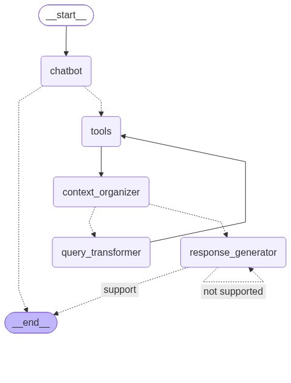

# Dart 공시 Agent

미래에셋 공모전 임시 test용

## 프로젝트 폴더

```

miraeasset-firstpenguin/
├── app/                          # 메인 애플리케이션 (LangGraph 에이전트)
│   ├── config.py                 # DB 경로 등 프로젝트 전역 설정 (SQLITE_URL, CHROMA_PATH ...)
│   ├── agent/
│   │   ├── agent.py              # 에이전트 정의
│   │   ├── db.py                 # DB 연결 (app/config.py의 경로 사용)
│   │   ├── edges.py              # 그래프 엣지(분기) 로직
│   │   ├── middleware.py         # 미들웨어
│   │   ├── nodes.py              # 그래프 노드
│   │   └── state.py              # 에이전트 상태 정의
│   ├── api/                      # (빈 디렉토리)
│   ├── schemas/
│   └── tools/
│       ├── hybrid_db_tools.py
│       ├── rdb_methods.py
│       └── vectordb_methods.py
│
├── dart_preprocessing/           # DART 공시 데이터 전처리 파이프라인
│   ├── chunker.py
│   ├── converters.py
│   ├── parsers.py
│   └── preprocesser.py           # 실행 시 db_tmp/에 DB 생성 (app/config.py의 경로 사용)
│
├── data/
│   └── 3.gongsi/
│       └── corpus/
│           ├── README.md
│           ├── data_filter.md
│           ├── manifest.jsonl
│           ├── universe.csv / universe.xlsx
│           └── raw/
│               ├── exchange/     # 70개 기업 디렉토리 (총 1,539개 파일)
│               ├── holding/      # 70개 기업 디렉토리 (총 1,150여개 파일)
│               ├── major/        # 70개 기업 디렉토리 (총 668개 파일)
│               └── periodic/     # 70개 기업 디렉토리 (총 1,542개 파일)
│
├── db_tmp/                       # (gitignore) DB 저장 통합 위치 - preprocesser.py 실행 시 자동 생성
│   ├── dart_financials.db        # RDB (SQLite)
│   └── chroma_db_temp/           # Vector DB (Chroma)
│
├── .env / .env.example
├── .gitignore
├── Dockerfile                    
├── fix_nfd.py
├── graph.png
├── readme.md
└── requirements.txt

```

> DB 경로는 `app/config.py` 한 곳에서만 정의합니다. RDB(SQLite)/VectorDB(Chroma) 모두 프로젝트 루트의 `db_tmp/` 밑에 생성되며, `app/agent/db.py`와 `dart_preprocessing/preprocesser.py`는 이 설정을 가져다 씁니다.

(ver.a.0823)

아래의 **싱글 에이전트**를 기본 모델로 삼고 있습니다.(임시 이미지)



# 사용법

- 일단 프로젝트 루트 폴더 바로 밑에 data/를 넣어주시는데, 원본 data/는 경로 중간 "3.공시" 이 부분 한글이 깨져있더라구요.
귀찮으시겠지만 "3.gongsi"로 고쳐주세요.
- `pip install -r requirements.txt` 먼저 해주세요.
- .env 파일에서 *clova api key*는 써주셔야 합니다. (수정: 0825)

그 후, 프로젝트 루트 위치에서

```python

python3 dart_preprocessing/preprocesser.py

```

하면 db가 생성될 겁니다.

계속해서, 

```python

python3 app/agent/agent.py 

```

해서 테스트해보시면 됩니다. agent.py 밑의 __main__ 내의 

```python

graph.astream(
        {
            "messages": [
                "가장 최근 공시 5개?"
            ]
        }

```

"messages" 이 부분에서 agent에게 보내는 질문 수정하실 수 있습니다.

## Plan

- [ ] "최근 공시 5개?" 라는 질문에 대해 문서를 못 찾고 우왕좌왕댐.

### 아이디어

#### 0. Architecture

- VectorDB, RDB, Agent의 컨테이너 분리할까요, 말까요?
- VPC는 예시에 다 나와있어서 크게 신경쓸 필요는 없을 것 같지 않음.

#### 1. RDB와 VectorDB의 조합

"무엇을 RDB에 넣고 무엇을 VectorDB에 넣을지"

-> 특히나 수치값들은 RDB로 정확하게 불러와야 함.

#### 2. 속도

Dart 공시에 관한 유투브 영상(활용영상)을 보니, 종종 "기자들이 기사를 쓰기 전에 빨리 여러 발표들을 볼 수 있다."라는 말이 있었음

<-- 그만큼 빠른 속도가 생명인듯함.

- 특히 DB에 저장되는 속도가 중요하지 않을까?
- 물어보는 쪽에서 빨리 답하려면 검색 알고리즘/ 추천 알고리즘을 통해 몇 가지 주요 내용들은 캐시서버를 따로 두는게 좋지 않을까?

#### 3. 편의

Dart를 대부분 모름. & 요즘 LLM 서비스를 보면 후속 질문, 추천 질문 등 기능이 있음.

-> Role을 나누어서 
- 전문가용 추천질문/후속질문
- 일반사용자용 추천질문/후속질문 (예: "이번 공시는 무슨 의미를 갖나요?")

파인튜닝을 해볼 수 있을 것 같다.

혹은 추천 알고리즘을 통해 구현할 수도 있을 것 같다.
